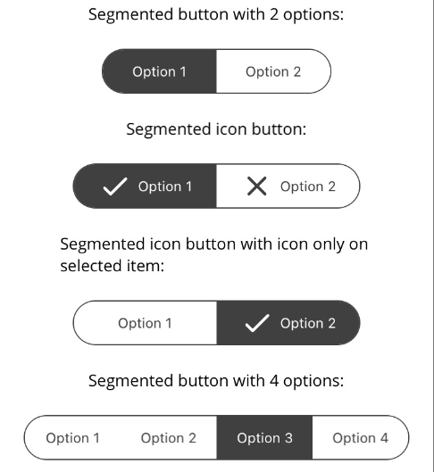

# UiToolkit MAUI 
The .NET UiToolkit is an open-source library that provides a set of controls and styles for building .NET MAUI applications. The toolkit is designed to be a consistent and flexible way to build cross-platform applications with .NET MAUI.

The nuget package is currently available as prerelease build: `dotnet add package UiToolkit.Maui --version 1.0.0-alpha`

## Getting Started
In order to use the UiToolkit you need to call the extension method `UseUiToolkit()` in your `MauiProgram.cs` file as follows:
```csharp
using UiToolkit.Maui;

public static class MauiProgram
{
	public static MauiApp CreateMauiApp()
	{
		var builder = MauiApp.CreateBuilder();
		builder
			.UseMauiApp<App>()
			.UseUiToolkit()
			.ConfigureFonts(fonts =>
			{
				fonts.AddFont("OpenSans-Regular.ttf", "OpenSansRegular");
				fonts.AddFont("OpenSans-Semibold.ttf", "OpenSansSemibold");
			});

		// Continue initializing your .NET MAUI App here

		return builder.Build();
	}
}
```
### XAML usage

In order to make use of the ui toolkit within XAML you can use this namespace:

```xml
xmlns:uikit="https://schemas.gd.com/dotnet/2024/maui"
```

## Controls

Name|Android|iOS|Windows|MacOS|Tizen|
:---------------------------:|:---:|:---:|:---:|:---:|:---:|
**Supported Version** |Android 10 (API 29+)|iOS 13+|Win 10+|N/A|N/A|
[ConditionalView](#conditionalview)|✅|✅|✅|✅|✅|
[IconPicker](#iconpicker)          |✅|✅*|❌|❌|❌|
[SegmentedButton](#segmentedbutton)|✅|✅|❌|❌|❌|

\* Not all features of the control are available on this Platform.

:x: Not implemented for the moment.

### ConditionalView
The `ConditionalView` control inherit from `ContentView`.

**Credits:** This control implementation is heavily inspired by [SingletonSean video](https://www.youtube.com/watch?v=BOYySROGooM).
#### Properties
Name          |  Type | Default value | Description |
-------------------------|:-------------------------:|:---:|----|
`Condition` | `bool` | `false` | Define which child view to display.|
`True` | `View` | `null` | Child `View` displayed in case `Condition` value is `True`.|
`False` | `View` | `null` | Child `View` displayed in case `Condition` value is `False`.|
#### Usage
```xml
<uikit:ConditionalView Condition="{Binding BooleanProperty}">
    <uikit:ConditionalView.True>
		<!-- Displayed this view when the condition is true -->
	</uikit:ConditionalView.True>
	<uikit:ConditionalView.False>
		<!-- Displayed this view when the condition is false -->
    </uikit:ConditionalView.False>
</uikit:ConditionalView>
```

<br/>It's also possible to declare only a view for the `True` or `False` Binding Property:

```xml
<uikit:ConditionalView Condition="{Binding BooleanProperty}">
    <uikit:ConditionalView.True>
		<!-- Displayed only when the condition is true -->
	</uikit:ConditionalView.True>
</uikit:ConditionalView>

<uikit:ConditionalView Condition="{Binding BooleanProperty}">
	<uikit:ConditionalView.False>
		<!-- Displayed only when the condition is false -->
    </uikit:ConditionalView.False>
</uikit:ConditionalView>
```

### IconPicker
<p align="center"></p>

`IconPicker` control inherit from `Picker` base control.

#### Properties

Name          |  Type | Default value | Description |
-------------------------|:-------------------------:|:---:|----|
`Source` | `ImageSource` | `null` | Define the source image icon. | 
`StrokeThickness` | `double` | `1.0` | Stroke size of the control.|
`Stroke` | `Color` | `null` | Stroke `Color` of the control.|
`CornerRadius` | `float` | `0` | Radius of the border corners. |

<span style="color: #FF0000"><b>Important:</b></span> Border personalization aren't supporter on iOS yet.

#### Usage

```xml
<uikit:IconPicker 
	Source="{FontImage FontFamily='MaterialIconsRound', Glyph={StaticResource IconMD_Expand_more}, Size=1, Color={StaticResource DarkGray}}" 
    TextColor="{StaticResource DarkGray}" TitleColor="{StaticResource DarkGray}"
    HorizontalTextAlignment="Center" Title="Select a monkey"
    CornerRadius="50" StrokeThickness="5" Stroke="{StaticResource DarkGray}"
    ItemsSource="{StaticResource array}">
</uikit:IconPicker>
```

### SegmentedButton
<p align="center"></p>
The `SegmentedButton` control inherit from `ContentView`.

#### Properties
Name          |  Type | Default value | Description |
-------------------------|:-------------------------:|:---:|----|
`FontFamily` | `ImageSource` | `null` | Define the source image icon. | 
`IsEnabled` | `bool` | `true` | Define control state enable/disable.|
`SelectedColor` | `Color` | `null` | Text color of the selected item. |
`UnselectedColor` | `Color` | `null` | Text color of the unselected item(s). |
`SelectedBackground` | `Color` | `null` | Background color of the selected item. |
`UnselectedBackground` | `Color` | `null` | Background color of the unselected item(s). |
`SelectedIcon` | `ImageSource` | `null` | Font icon to display on the selected item. |
`UnselectedIcon` | `ImageSource` | `null` | Font icon to display on the unselected item(s). |
`ItemsSource` | `IEnumerable<SegmentedItem>` | `Required` | List of segment items. |
`SelectedItem` | `SegmentedItem` | `null` | `BindingMode.TwoWay` property binded to the selected item. |

```xml
<uikit:SegmentedButton 
	HeightRequest="40" WidthRequest="200"
	Stroke="{AppThemeBinding Light={StaticResource Gray600}, Dark='White'}" StrokeThickness="1" 
	SegmentItems="{StaticResource array}"
	SelectedColor="{AppThemeBinding Light='White', Dark={StaticResource Gray600}}"
	SelectedBackground="{AppThemeBinding Light={StaticResource Gray600}, Dark='White'}"
	UnselectedColor="{AppThemeBinding Light={StaticResource Gray600}, Dark='White'}"
	UnselectedBackground="{AppThemeBinding Light='White', Dark={StaticResource Gray600}}"/>
```

## Converters
Name          |  Description |
-------------------------|-------------------------|
`EnumToStringConverter` | Two-way converter to convert `Enum` value to their `string` representation. |